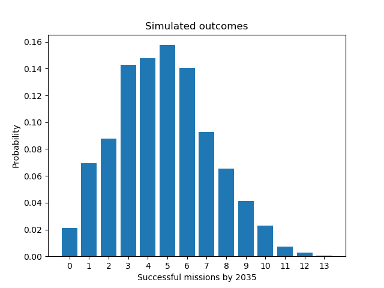

# Moon Landings by 2035

For [Stat 165](https://forecastingclass.com/sp24/), my group forecasted the number of successful moon landings by June 1st, 2035.

We estimated a probability distribution the number of successful missions along with the sensitivity of the model to each of its parameters:

